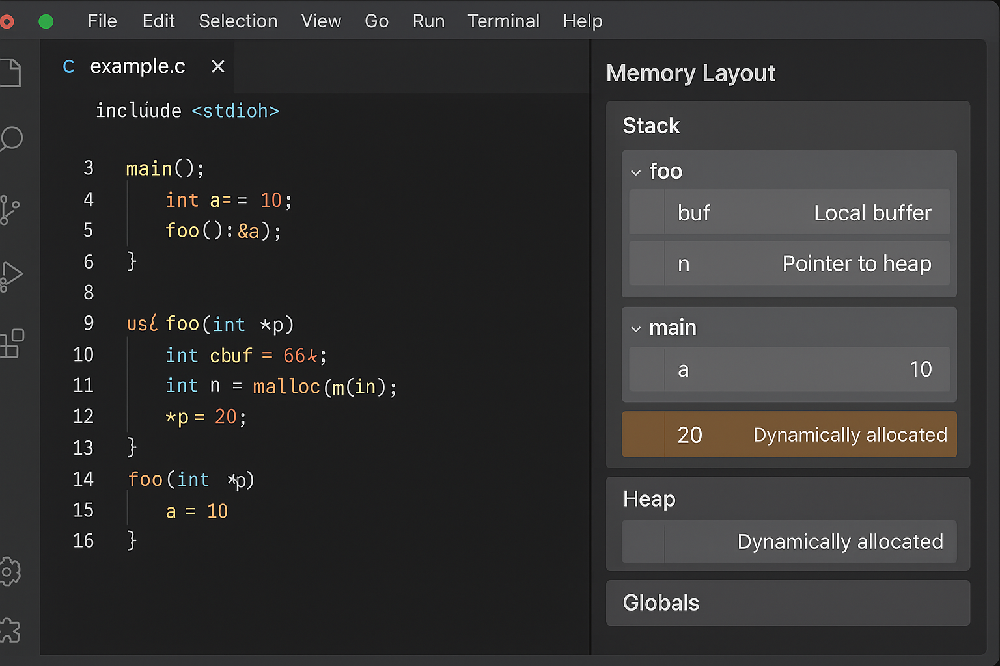

# 🧠 Memory Layout Visualizer for VS Code

> A real-time memory layout visualizer for C, C++, and Rust code — see your stack, heap, and global variables as you code!



## 📌 Overview

The **Memory Layout Visualizer** is a Visual Studio Code extension that provides an interactive visualization of your program’s memory model. As you write or navigate code, the extension dynamically displays:

- 📚 **Stack frames** with local variables  
- 🧱 **Heap allocations** from calls like `malloc()` or `new`  
- 🌍 **Global/static variables**  
- 🧭 Pointer relationships and memory sizes

Ideal for learning, debugging, and understanding memory behavior in systems-level programming.

---

## ✨ Features

- ✅ Real-time memory layout synced with the editor
- 🧩 Visual blocks for Stack, Heap, and Globals
- 📦 Support for C, C++, and Rust
- 🧠 (Optional) AI-powered explanations of memory usage
- 🎨 Theme-aware and responsive layout
- 🔍 Hover tooltips for variable types, sizes, and scopes

---

## 🚀 Getting Started

### 1. Install from VS Code Marketplace (coming soon)

```bash
# Or use this in the Extensions panel:
Memory Layout Visualizer
```

### 2. Open any C/C++/Rust file  
The extension automatically activates and displays the layout in the side panel.

### 3. Use the Command Palette
Run `Open Memory Visualizer` from the Command Palette (`Ctrl+Shift+P`).

---

## 🛠 Under the Hood

- Built with VS Code's Webview API
- Uses **Tree-sitter** or **Language Server Protocol (LSP)** for parsing
- Visualization powered by **D3.js** / **SVG**
- Memory model simulation is static (compile-time estimation)

---

## 🧪 Language Support

| Language | Status    |
|----------|-----------|
| C        | ✅ Stable |
| C++      | ✅ Stable |
| Rust     | 🚧 In Progress |
| Go       | ❌ Planned |
| Python   | ❌ Not applicable |

---

## 💡 Use Cases

- Learning systems programming or embedded dev
- Teaching memory management to students
- Debugging memory-related issues visually
- Understanding complex pointer structures

---

## 📂 Project Structure

```
memory-layout-visualizer/
├── src/                  # Extension backend
├── webview/              # HTML/CSS/JS for memory layout UI
├── assets/               # Screenshots, icons
├── package.json          # Extension metadata
└── README.md
```

---

## 📦 Build and Run Locally

```bash
# Clone the repo
git clone https://github.com/your-username/memory-layout-visualizer.git
cd memory-layout-visualizer

# Install dependencies
npm install

# Launch in VS Code
code .

# Press F5 to open a new Extension Development Host
```

---

## 🤝 Contributing

Pull requests are welcome! Please check our [CONTRIBUTING.md](CONTRIBUTING.md) guide for details.

- Add new language support
- Improve the UI/UX
- Write test cases for the parser or memory model
- Suggest features via GitHub Issues

---

## 📃 License

[MIT License](LICENSE)

---

## 🙏 Acknowledgments

- [Tree-sitter](https://tree-sitter.github.io/)
- [Mermaid.js](https://mermaid.js.org/) and [D3.js](https://d3js.org/)
- Inspired by memory models taught in CS curriculums
